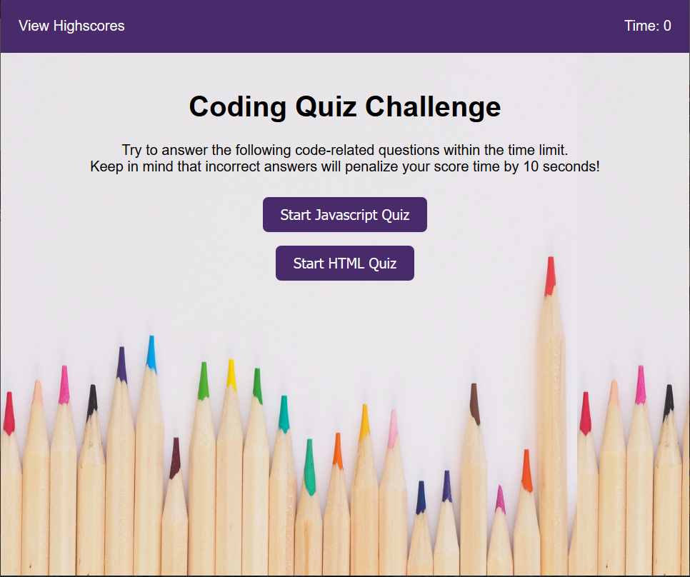

# Code Quiz week4
## Description 
This is a on-line quiz for Javascript. The application asks multiple questions and you need to answer the question within the specified time frame. 

## Usage 
You will have ( 15sec * Number of Questions ) for the quiz. Your score will be calculated by the time remaining at the end of all questions. If you answer incorrectly, you will lose 10 sec. You will need to answer until you get the correct answer.  
The game ends when the time becomes 0 or you have answered all questions. 

1. Open the URL. 
https://tak-9.github.io/week4/
2. Click Start Quiz button.
3. Answer each questions accordingly. 
4. "All done!" is displayed when you finish all questions or your time is over. 
   Enter initals and click "Submit". 
5. Highscores is displayed. 
6. You can click "Go Back" to go back to the first page or "Clear Highscores" to clear records.

## Screen Capture 

